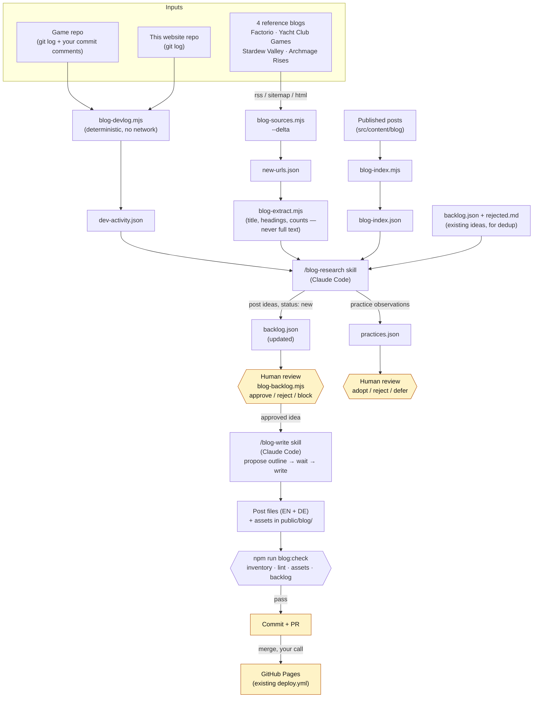

# Devlog pipeline — how to use it

Turns your own development (this repo + the game repo) and four reference blogs into a reviewed
backlog of devlog post ideas, then into published posts. You approve everything; nothing writes or
publishes on its own. Full architecture and rationale: [`docs/blog-automation.md`](../../docs/blog-automation.md).
Genre adaptation ("why a devlog, not an SEO blog"): [`_port/blog-pipeline-port-devlog.md`](../../_port/blog-pipeline-port-devlog.md).

## The flow



Diamond boxes are where a human decides — the pipeline never approves its own ideas, never writes
without an approved idea, and never publishes (a merge is always your call).

## Quick start (already done for this repo — for reference)

```bash
cp content/ideas/sources.example.json content/ideas/sources.local.json   # fill in real URLs
cp content/ideas/repos.example.json    content/ideas/repos.local.json    # point at the game repo
```

Both `*.local.json` files are gitignored on purpose — see "Privacy" in `docs/blog-automation.md`.

## Weekly-ish routine

1. **Discover + cluster** (deterministic, no tokens):
   ```bash
   npm run blog:weekly
   ```
   Runs `blog-sources.mjs --delta`, `blog-index.mjs` and `blog-devlog.mjs`, then prints a briefing:
   new reference posts, backlog counts, blocked ideas, and — loudly — any source that came in short.
   A `SOURCE FAILURE` block means don't trust "0 new posts" until it's fixed; see the command it
   suggests (`blog-sources.mjs --probe`).

2. **Generate ideas** — run the `/blog-research` skill in Claude Code. Reads `dev-activity.json`
   (primary — your own work) plus the reference-blog extracts, appends scored ideas to
   `backlog.json` (`status: "new"`) and practice observations to `practices.json`.

3. **Review** (the five-minute human gate):
   ```bash
   node scripts/blog-backlog.mjs                          # list everything, highest score first
   node scripts/blog-backlog.mjs --show 003                # full detail
   node scripts/blog-backlog.mjs --approve 003 005          # approve one or more
   node scripts/blog-backlog.mjs --reject 004 --reason "..."
   node scripts/blog-backlog.mjs --block 002 --reason "..." --followup "..."
   ```
   Same idea for `practices.json`, but by hand — set `decision` to `adopted`/`rejected`/`deferred`
   and `decided_at` to today.

4. **Write** (once something is `approved`) — run the `/blog-write` skill. Picks the highest-scored
   approved idea, researches, **proposes an outline and waits for your go-ahead**, writes both
   locales, then verifies:
   ```bash
   npm run blog:check
   ```

5. **Publish** — commit, open a PR, merge when you're ready. `published` on the idea reflects that
   a merge already happened, not the other way around.

## Reminder

`.claude/settings.json`'s `SessionStart` hook runs `blog-weekly.mjs --check` at the start of every
Claude Code session in this repo. Silent unless the reminder is actually due
(`cadence_days` in `blog.config.json`, 30 by default) — it will not nag you every session.

## Command reference

| Command | What it does |
| --- | --- |
| `npm run blog:weekly` | discovery + own inventory + dev-activity briefing |
| `npm run blog:check` | all four gates: inventory, conventions, images, backlog |
| `npm run blog:lint` | conventions gate only |
| `npm run blog:assets` | image gate only |
| `npm run blog:dev` | regenerate `dev-activity.json` on its own |
| `node scripts/blog-sources.mjs --probe` | reachability check per reference blog, writes nothing |
| `node scripts/blog-sources.mjs --baseline` | one-time full discovery (before the first `--seed`) |
| `node scripts/blog-backlog.mjs --next` | what `/blog-write` would pick up right now |
| `node scripts/blog-backlog.mjs --validate` | integrity check on `backlog.json`, exit 1 on error |

## Never

- Auto-approve an idea or a practice — every one starts at `status: "new"`.
- Lower an `expected_min` in `sources.local.json` to clear a `FAIL` — fix the source or disable it.
- Treat reference-blog posts as topics — they teach format and cadence, not what to write about.
- Publish from the pipeline — `published` is set after a merge, and the merge is your call.
